<h1 align="left">Hi 👋, I'm Seán</h1>
<h3 align="left">An Electronic & Computer Engineer from Galway, Ireland</h3>

- 🔭 I am currently working on: [Logicademy](https://github.com/Logicademy), [Grand Star (rust-wii)](https://github.com/rust-wii/)

- 🎓 I am currently studying: Electronic & Computer Engineering (BE. + ME.) @ University of Galway, Ireland

- 👔 I am currently working for: [Grafton Digital](https://github.com/Grafton-Digital)

- 🌱 I am currently learning: **SoC Design / Python / Rust / Homebrew Computing**

- 💬 Ask me about: **Embedded Systems, Homebrew Computers, Game Dev**

- 📫 How to reach me: **crash@override.online**

- ⚡ Fun fact: **I got Rust running on the Nintendo Wii**

<!-- Connection badges (Twitter, LinkedIn) -->
<h3 align="left">Connect with me:</h3>

<!-- Language and Tooling badges -->
<h3 align="left">Languages and Tools:</h3>

